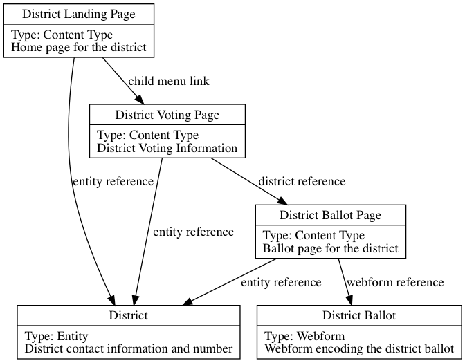

[SF Participatory Budgeting Site](https://sfpbd.sfgov.org/)
===============

Each year in San Francisco, some number of supervisorial districts participate in a [participatory
budgeting](https://www.participatorybudgeting.org/) process, allowing community members to propose and vote on projects
to fund in their district.

This repository contains the source code (a Drupal CMS) used for the [website](https://sfpbd.sfgov.org/) which houses
both the content describing the program as well as acting as the online ballot when voting is open.

An attempt was not made to generalize the code to allow for re-use by other cities, but it is likely possible to use it
as an example and basis for implementing your own online participatory budgeting website. If you are interested in
reusing this in your city, leave a comment on [Finish
Whitelabeling](https://github.com/SFDigitalServices/participatory_budget/issues/1) to help us gauge interest.

## History

The participatory budget process varies by district, but generally involves a period of soliciting proposals from
residents, curating these, and creating a ballot for the district to vote on. In the past this has been done via paper
ballots, but, in the 2013-2014 cycle, an online ballot was created for participating districts.

In the 2017-2018 cycle, this was moved to a Drupal CMS to allow District Offices to maintain the content which
previously required engineers to update.

## Users

* Residents of participating supervisorial districts who vote on the ballot each year
* Controller's Office staff that oversee the process
* District Office staff that update and maintain the content
* Digital Services engineering to administer and build the online ballots

## Problem being solved / Project goals

Goal is to increase participation in the participatory budget process by allowing residents to view and submit ballots
online that previously required them to be present at a physical location to particpate.

See also: [What Online Ballots Did for Inclusion in Participatory Budgeting: San
Francisco](https://www.publicagenda.org/blogs/online-voting-to-expand-inclusion-in-participatory-budgeting-san-francisco)

## Project Management

Very light project management that, in 2017-2018, involved direct communication between District Staff, Controller's
Office, and the Digital Services team via email and phone.

## Setup

### Using Docker

You need [Docker](https://github.com/docker/docker) and [docker-compose](https://github.com/docker/compose).

To build and run the app with docker-compose, run `docker-compose up` then you can access the app from
`http://localhost:8080`, as the local filesystem is mounted into the docker container you can edit the files as you are
developing locally.

For more details on both of these tools, Docker and docker-compose, see [Getting started with
Docker](https://docs.docker.com/get-started/) and [Getting started with
docker-compose](https://docs.docker.com/compose/gettingstarted/).

#### Using drush and drupal commands

You can execute `drush` and `drupal` commands from within the container via:

```
$ docker exec -it participatorybudget_httpd_1 /bin/bash # get shell in container
$ ./vendor/bin/drush
$ ./vendor/bin/drupal
```

### Development configuration

Copy the example development configuration:

```
cp sites/example.settings.local.php sites/default/settings.local.php
```

This will includes some defaults that make installation and development simpler by disabling caching and configuring the
database connection info such that it'll Just Work™ with the docker-compose configuration. See file comments for
additional details.

From here you can either bootstrap by copying the production database locally or install Drupal from
scratch as described below.

### Drupal installation from scratch

Open `localhost:8080` which should, by default, open the Drupal installation page. From here:

1. Choose the minimal install profile
1. Fill in the basic site information. Aside from the admin account, this will be overwritten during config import
1. Enable the Configuration (`config`) module through the UI (http://localhost:8080/admin/modules) or via
   `./vendor/bin/drush pm-enable config` (inside the container)
1. Set the site uuid to the expected value via `./vendor/bin/drush config-set "system.site" uuid
  "fjfj34-e3bb-2ab8-4d21-9100-b5etgetgd99d5"` (the value in `sites/default/config/system.site.yml`) within the container
1. Run the configuration import via the UI (http://localhost:8080/admin/config/development/configuration) or via
   `./vendor/bin/drush config-import`
1. Create the following initial entities and content (see [Content Help](#content-help)) for more details
   *  A District entity via http://localhost:8080/admin/structure/district/add
   *  A District Landing Page for the district via http://localhost:8080/node/add/district_landing_page
   *  A District Voting Page for the district via http://localhost:8080/node/add/district_voting_page
   *  A District Ballot Page for the district via http://localhost:8080/node/add/district_ballot_page (select an
      existing ballot)
   *  Add links to the main navigation menu (http://localhost:8080/admin/structure/menu/manage/main) to create the
      following structure: `District Landing Page -> District Voting Page`
   *  Create an Empty page (http://localhost:8080/node/add/empty) with the alias `/home` to serve as the homepage

**TODO**: Possibly automate this setup [via an install profile](https://www.drupal.org/project/drupal/issues/1613424).

## Relationships

Diagram of entity and content type relationships:



## Content Help

Documentation for keeping content up-to-date, adding additional districts, and additional ballots is stored within
Drupal for editors to be able to easily access it. You can view it via
`http://localhost:8080/admin/help/ccsf_participatory_budget` during development.

## Deploying

This application is hosted on [Pantheon](http://pantheon.io). The workflow for deploying is best described by their
[workflow documentation](https://pantheon.io/docs/pantheon-workflow/).

## Ballot processing

Some districts have found it useful to have the district for each submission identified to ensure that voters are within
the district the ballot is for. To aid with this, `scripts/annotate_results_with_district_number.py` can be used to add
the additional information to a downloaded CSV of the results for a given ballot. See `-h` usage for help.
